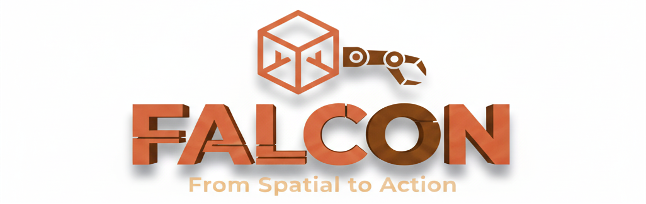
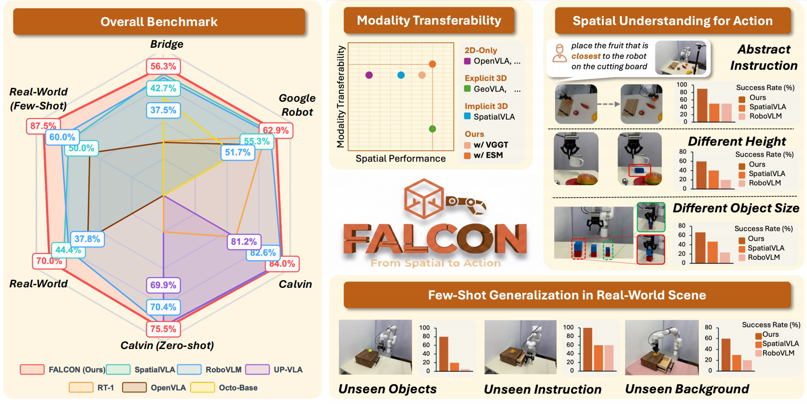
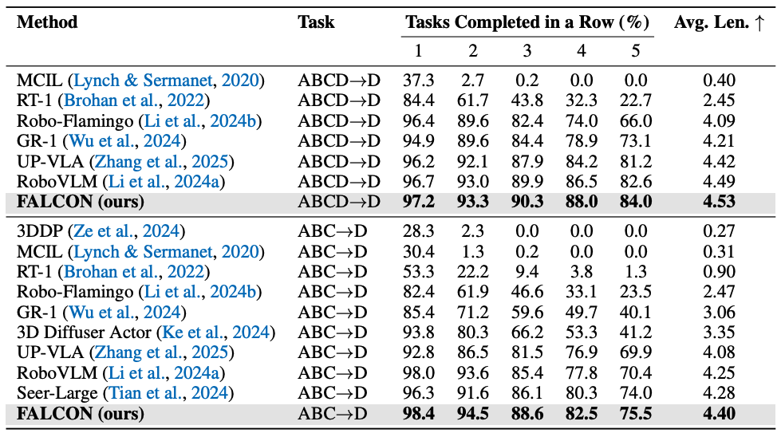
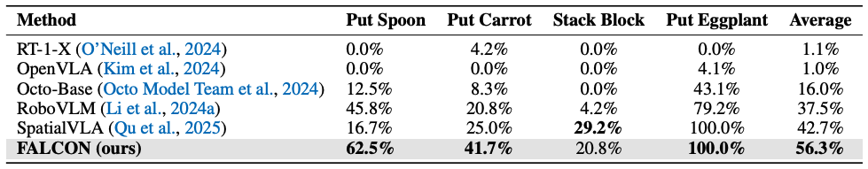
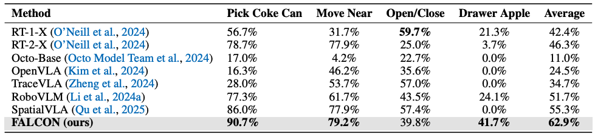
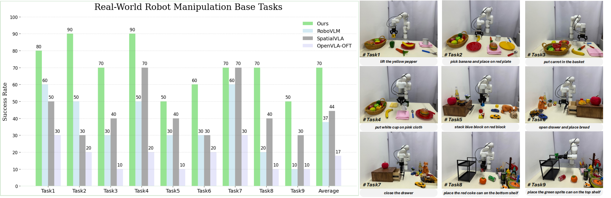

<div align="center">

<p>
    
</p>

#  | *FALCON* | From Spatial to Actions: <br>Grounding Vision-Language-Action Model in Spatial Foundation Priors (ICLR 2026)

<a href="https://arxiv.org/abs/2510.17439" target="_blank">
    
</a>
<a href="https://falcon-vla.github.io/" target="_blank">
    
</a>
<a href="https://huggingface.co/papers/2510.17439" target="_blank">
    
</a>
<a href="https://huggingface.co/FALCON-VLA" target="_blank">
    
</a>
<!-- <a href="https://huggingface.co/datasets/robovlms/bytedance_robot_benchmark_20" target="_blank">
    
</a> -->
<br>
<a href="https://www.python.org/" target="_blank">
    
</a>
<a href="https://pytorch.org/" target="_blank">
    
</a>

</div>

<div align="center">
    <br>
<div style="text-align: center;">
    <a href="https://scholar.google.com/citations?user=8nrJ1vsAAAAJ&hl=en"  target="_blank">Zhengshen Zhang</a> &emsp;
    <a href="https://scholar.google.com/citations?user=4dokjDoAAAAJ&hl=zh-CN"  target="_blank">Hao Li</a> &emsp;
    <a href="https://scholar.google.com/citations?user=6XyNVowAAAAJ&hl=en"  target="_blank">Yalun Dai</a> &emsp;
    <a href="https://scholar.google.com/citations?user=ozatRA0AAAAJ&hl=zh-CN"  target="_blank">Zhengbang Zhu</a> &emsp;
    <a href="https://scholar.google.com/citations?user=VhToj4wAAAAJ&hl=zh-CN"  target="_blank">Lei Zhou</a> &emsp;
    <br>
    <a href="https://sg.linkedin.com/in/liu-chenchen"  target="_blank">Chenchen Liu</a> &emsp;
    <a href=""  target="_blank">Dong Wang</a> &emsp;
    <a href="https://scholar.google.com/citations?user=mfH9UFIAAAAJ&hl=en"  target="_blank">Francis E. H. Tay</a> &emsp;
    <a href="https://ch3cook-fdu.github.io/"  target="_blank">Sijin Chen</a> &emsp;
    <br>
    <a href="https://liuziwei7.github.io/"  target="_blank">Ziwei Liu</a> &emsp;
    <a href="https://scholar.google.com/citations?user=i8wNtSgAAAAJ&hl=en"  target="_blank">Yuxiao Liu</a><sup>*</sup><sup>&dagger;</sup> &emsp;
    <a href="https://scholar.google.com/citations?user=laOWyTQAAAAJ&hl=zh-CN"  target="_blank">Xinghang Li</a><sup>*</sup> &emsp;
    <a href="https://panzhous.github.io/"  target="_blank">Pan Zhou</a><sup>*</sup> &emsp;
    <br>
    <p style="text-align: center; margin-bottom: 0;">
        <span class="author-note"><sup>*</sup>Corresponding Author</span>&emsp;
        <span class="author-note"><sup>&dagger;</sup>Project Lead</span>
    </p>
<br>
<p style="text-align: center;">
    ByteDance Seed <br> 
    National University of Singapore &emsp; Nanyang Technological University <br>
    Tsinghua University &emsp; Singapore Management University</p>
</div>
</div>

<hr>

<p>
    
</p>

## Updates 🚀🚀🚀
- [25/03/2026] Released **inference code of FALCON** and **relevant weights on CALVIN & SimplerEnv**, please feel free to try our model!

- [26/01/2026] 🎊 Thrilled to share that our paper has been accepted to ICLR 2026! Code will be open-sourced soon. Stay tuned!

- [20/10/2025] Existing vision-language-action (VLA) models act in 3D real-world but are typically built on 2D encoders, leaving a spatial reasoning gap that limits generalization and adaptability. In this work, we introduce **FALCON (From Spatial to Action)**, a novel paradigm that injects rich 3D spatial tokens into the action head of a VLA model, enabling robust spatial understanding and SOTA performance across diverse manipulation tasks without disrupting vision-language alignment. See our paper at [here](https://arxiv.org/abs/2510.17439).

## Contents
- [Installation](#installation)
- [Benchmark Performance Comparison](#benchmark-performance-comparison)
- [Model Zoo](#model-zoo)
- [Evaluation](#evaluation)
- [TODO List](#todo-list)
- [FAQs](#faqs)
- [Citation](#citation)
- [License](#license)
- [Acknowledgement](#acknowledgement)

## 🔧 Installation <a name="installation"></a>
```bash
# Clone the repository
git clone https://github.com/FALCON-VLA/FALCON.git
cd FALCON
```
💡 For now, we support <a href="" target="https://github.com/mees/calvin">CALVIN</a> and <a href="" target="https://github.com/simpler-env/SimplerEnv">SimplerEnv</a>, you can follow their guidance to download the training/validation data. Besides, we suggest create seperate virtual envs for different benchmarks to prevent from conflicts. Also, we provide **easy-setup scripts** to help you setup the environments that is compatible with our codebase for running these benchmarks:
### CALVIN Benchmark
```bash
# If you want to run training/eval on CALVIN
conda create -n falcon_calvin python=3.8.20 -y
conda activate falcon_calvin
pip install -e .

# For CALVIN Installation
bash scripts/setup_calvin.sh
```
### SimplerEnv Experiments
```bash
# If you want to run training/eval on SimplerEnv
conda create -n falcon_oxe python=3.10 -y
conda activate falcon_oxe
pip install -e .

# For training on OXE dataset, using our fork of openvla
cd ..
git clone https://github.com/lixinghang12/openvla
cd openvla
pip install -e .

cd ../FALCON
# For SimplerEnv Installation
bash scripts/setup_simplerenv.sh

# Making soft link to assets of SimplerEnv for eval
sudo ln -s ./SimplerEnv/ManiSkill2_real2sim/data/real_inpainting real_inpainting
```
To validate if CALVIN/SimplerEnv is successfully installed, run the following command for testing:
```python
# For CALVIN simulation Verification
python eval/calvin/env_test.py

# For SimplerEnv simulation Verification
python eval/simpler/env_test.py
```

## 💪 Benchmark Performance Comparison <a name="benchmark-performance-comparison"></a>
### CALVIN Benchmark


### SimplerEnv WidowX Robot Experiments


### SimplerEnv Google Robot Experiments


### Real-World Experiments

💡 For more sim/real-world benchmark results, please refer to our paper.

## 🤗 Model Zoo <a name="model-zoo"></a>
We provide the following model weights and their config files in our paper:

<table>
  <tr>
    <th>Model Name</th>
    <th>VLA Model</th>
    <th>Embodied Spatial Model</th>
    <th>Note</th>
  </tr>
  <tr>
    <td>FALCON-FC-CALVIN-ABC</td>
    <td><a href="https://huggingface.co/FALCON-VLA/FALCON-series/tree/main/falcon-esm-fc-calvin-abc/ckpts">falcon-esm-fc-calvin-abc-pt</a></td>
    <td><a href="https://huggingface.co/FALCON-VLA/FALCON-series/tree/main/esm">esm-1b</a></td>
    <td>finetune on calvin-abc with RGB inputs to ESM, Tab. 4 and 5.</td>
  </tr>
  <tr>
    <td>FALCON-FC-CALVIN-ABC-WDepth</td>
    <td><a href="https://huggingface.co/FALCON-VLA/FALCON-series/tree/main/falcon-esm-fc-calvin-abc-wdepth/ckpts">falcon-esm-fc-calvin-abc-wdepth-pt</a></td>
    <td><a href="https://huggingface.co/FALCON-VLA/FALCON-series/tree/main/esm">esm-1b</a></td>
    <td>finetune on calvin-abc with RGB-D inputs to ESM, Tab. 5.</td>
  </tr>
  <tr>
    <td>FALCON-3DPC-FC-CALVIN-ABC</td>
    <td><a href="https://huggingface.co/FALCON-VLA/FALCON-series/tree/main/falcon-3dpc-fc-calvin-abc/ckpts">falcon-3dpc-fc-calvin-abc-pt</a></td>
    <td><a href="https://github.com/YanjieZe/Improved-3D-Diffusion-Policy">improved DP3 encoder</a></td>
    <td>finetune on calvin-abc with point cloud inputs to idp3 encoder, Tab. 5-Kosmos-VLA <i>(w/ rgb-d)</i>.</td>
  </tr>
  <tr>
    <td>FALCON-LSTM-CALVIN-ABC</td>
    <td><a href="https://huggingface.co/FALCON-VLA/FALCON-series/tree/main/falcon-esm-lstm-calvin-abc/ckpts">falcon-lstm-calvin-abc-pt</a></td>
    <td><a href="https://huggingface.co/FALCON-VLA/FALCON-series/tree/main/esm">esm-1b</a></td>
    <td>finetune on calvin-abc with RGB inputs to ESM, Tab. 1.</td>
  </tr>
  <tr>
    <td>FALCON-LSTM-CALVIN-ABCD</td>
    <td><a href="https://huggingface.co/FALCON-VLA/FALCON-series/tree/main/falcon-esm-lstm-calvin-abcd/ckpts">falcon-lstm-calvin-abcd-pt</a></td>
    <td><a href="https://huggingface.co/FALCON-VLA/FALCON-series/tree/main/esm">esm-1b</a></td>
    <td>finetune on calvin-abcd with RGB inputs to ESM, Tab. 1.</td>
  </tr>
  <tr>
    <td>FALCON-FC-SimplerEnv-Bridge</td>
    <td><a href="https://huggingface.co/FALCON-VLA/FALCON-series/tree/main/falcon-esm-fc-simpler-bridge/ckpts">falcon-fc-simpler-bridge-pt</a></td>
    <td><a href="https://huggingface.co/FALCON-VLA/FALCON-series/tree/main/esm">esm-1b</a></td>
    <td>pretrained on oxe then finetune on bridge dataset with RGB inputs to ESM, Tab. 2.</td>
  </tr>
  <tr>
    <td>FALCON-FC-SimplerEnv-Fractal</td>
    <td><a href="https://huggingface.co/FALCON-VLA/FALCON-series/tree/main/falcon-esm-fc-simpler-gr/ckpts">falcon-fc-simpler-fractal-pt</a></td>
    <td><a href="https://huggingface.co/FALCON-VLA/FALCON-series/tree/main/esm">esm-1b</a></td>
    <td>pretrained on oxe then finetune on fractal dataset with RGB inputs to ESM, Tab. 3.</td>
  </tr>
</table>

## 🏃 Evaluation <a name="evaluation"></a>
<!-- During training, the model checkpoint and running configuration are saved at the paths specified by the `output_root` and `log_root` in the config file.  -->
### Evaluation on CALVIN
💡 Add the paths to your model checkpoint and configuration files in the `ckpt_paths` list for calvin eval script `eval/calvin/eval_ckpts.py` as shown below:
```python
ckpt_paths = [
    ("path/to/VLA-Checkpoint-{epoch}-{steps}.ckpt/or/VLA-Checkpoint.pt", 
    "path/to/VLA-Checkpoint-config.json")
]
```
We recommend using multi-gpus (e.g., 8 gpus) to parallel run the eval script:
```bash
python eval/calvin/eval_ckpts.py
```
After running the eval script, the results will be saved in the `eval/calvin/logs` directory, then use the following script to gather the results from each gpu:
```bash
python3 tools/merge_multi_rank_res.py
```
> [!NOTE]
> For FALCON with fc action head, add `--act_chunk` in `scripts/run_eval_raw_ddp_torchrun.sh` for action chunking rollouts. For FALCON with lstm action head, remove `--act_chunk` for single-step rollout with action ensemble.

### Evaluation on SimplerEnv
💡 Before running, make sure that you have the right path to SimplerEnv Real-Sim image assets. We recommand make a soft link for `SimplerEnv/ManiSkill2_real2sim/data/real_inpainting` to run the provided eval scripts.

Add the paths to your model checkpoint, configuration files, and the eval output logs in the `ckpt_paths` list for SimplerEnv eval scripts as shown below:
```python
ckpt_paths = [
    ("path/to/VLA-Checkpoint-{epoch}-{steps}.ckpt/or/VLA-Checkpoint.pt", 
    "path/to/VLA-Checkpoint-config.json",
    "path/to/SimplerEnv-eval-logs")
]
```
To evaluate the model on **Google Robot/Fractal** environment, use the following command and we recommend using multi-gpus (e.g., 4 gpus) to accelerate the evaluation:
```bash
# For single gpu eval
python eval/simpler/eval_ckpts_google_robot.py
# For multi-gpus eval
python eval/simpler/eval_ckpts_google_robot_parallel.py
```
For evaluation on **Bridge** environment, run:
```bash
python eval/simpler/eval_ckpts_bridge.py
```
After running the eval script, the log files will be saved in the `path/to/SimplerEnv-eval-logs` directory that you have set, then use the following script to obtain the final results:
```bash
# For bridge results summary
python3 tools/summary_bridge_results.py <PATH-TO-UR-LOG-FILE>
# For gr results summary
python3 tools/summary_gr_results.py <PATH-TO-UR-LOGS-FOLDER>
# For gr/bridge sub-task results summary
python3 tools/get_simpler_results.py
```
> [!NOTE]
> Please make sure that the paths to the model checkpoints and configuration files are correct and match the setup of your environment before running the benchmark evaluation scripts.

## 🗒️ TODO List <a name="todo-list"></a>
- [x] Release the code, model of FALCON.
- [x] Release the CALVIN & SimplerEnv evaluation code and model weights for FALCON series.
- [ ] Release pre-training / fine-tuning code for FALCON series.
- [ ] Release the code for real-world deployment of FALCON via [ManiUniCon](https://github.com/Universal-Control/ManiUniCon).

## 🤗 FAQs <a name="faqs"></a>
If you encounter any issues, feel free to open an issue on GitHub or reach out through discussions. We appreciate your feedback and contributions! 🚀

## 🖊️ Citation <a name="citation"></a>
If you find this project useful in your research, please consider cite:
```BibTeX
@article{zhang2025spatial,
  title={From spatial to actions: Grounding vision-language-action model in spatial foundation priors},
  author={Zhang, Zhengshen and Li, Hao and Dai, Yalun and Zhu, Zhengbang and Zhou, Lei and Liu, Chenchen and Wang, Dong and Tay, Francis EH and Chen, Sijin and Liu, Ziwei and others},
  journal={arXiv preprint arXiv:2510.17439},
  year={2025}
}
```

## 🪪 License <a name="license"></a>
This project is licensed under the [Apache-2.0 License](LICENSE).

## ❤️ Acknowledgement <a name="acknowledgement"></a>
FALCON is built with reference to the code of the following projects: [RoboVLMs](https://github.com/Robot-VLAs/RoboVLMs/tree/main?tab=readme-ov-file), [Microsoft Kosmos-2](https://github.com/microsoft/unilm/tree/master/kosmos-2), [VGGT](https://github.com/facebookresearch/vggt), and [ManiUniCon](https://github.com/Universal-Control/ManiUniCon). Thanks for their awesome work!
