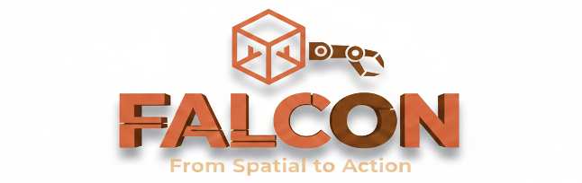
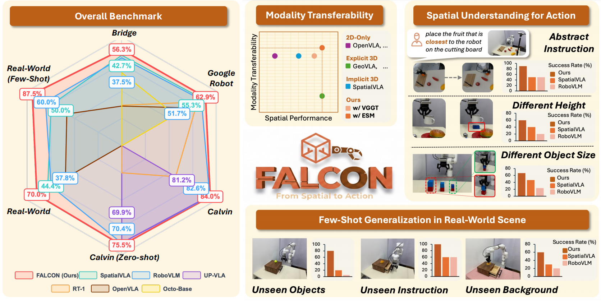
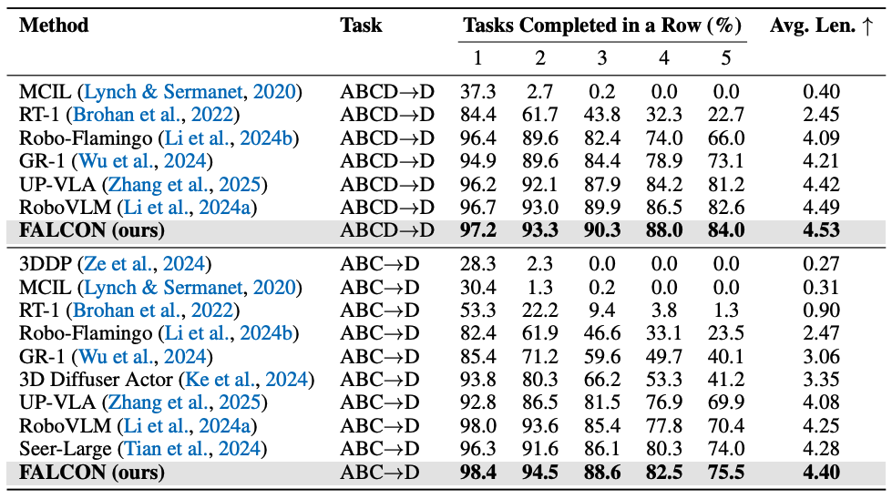
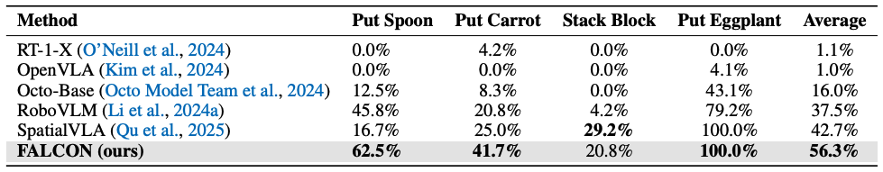
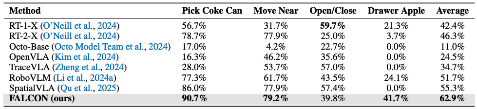
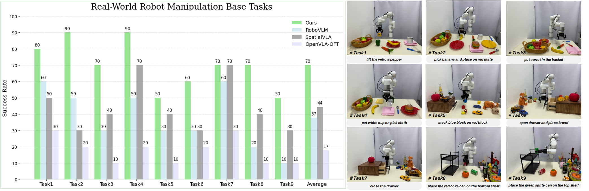

<div align="center">

<p>
    
</p>

#  | *FALCON* | From Spatial to Actions: <br>Grounding Vision-Language-Action Model in Spatial Foundation Priors (ICLR 2026)

<a href="https://arxiv.org/abs/2510.17439" target="_blank">
    
</a>
<a href="https://falcon-vla.github.io/" target="_blank">
    
</a>
<a href="https://huggingface.co/papers/2510.17439" target="_blank">
    
</a>
<a href="https://huggingface.co/FALCON-VLA/FALCON-series" target="_blank">
    
</a>
<a href="https://huggingface.co/FALCON-VLA/datasets" target="_blank">
    
</a>
<br>
<a href="https://www.python.org/" target="_blank">
    
</a>
<a href="https://pytorch.org/" target="_blank">
    
</a>

</div>

<div align="center">
    <br>
<div style="text-align: center;">
    <a href="https://scholar.google.com/citations?user=8nrJ1vsAAAAJ&hl=en"  target="_blank">Zhengshen Zhang</a> &emsp;
    <a href="https://scholar.google.com/citations?user=4dokjDoAAAAJ&hl=zh-CN"  target="_blank">Hao Li</a> &emsp;
    <a href="https://scholar.google.com/citations?user=6XyNVowAAAAJ&hl=en"  target="_blank">Yalun Dai</a> &emsp;
    <a href="https://scholar.google.com/citations?user=ozatRA0AAAAJ&hl=zh-CN"  target="_blank">Zhengbang Zhu</a> &emsp;
    <a href="https://scholar.google.com/citations?user=VhToj4wAAAAJ&hl=zh-CN"  target="_blank">Lei Zhou</a> &emsp;
    <br>
    <a href="https://sg.linkedin.com/in/liu-chenchen"  target="_blank">Chenchen Liu</a> &emsp;
    <a href=""  target="_blank">Dong Wang</a> &emsp;
    <a href="https://scholar.google.com/citations?user=mfH9UFIAAAAJ&hl=en"  target="_blank">Francis E. H. Tay</a> &emsp;
    <a href="https://ch3cook-fdu.github.io/"  target="_blank">Sijin Chen</a> &emsp;
    <br>
    <a href="https://liuziwei7.github.io/"  target="_blank">Ziwei Liu</a> &emsp;
    <a href="https://scholar.google.com/citations?user=i8wNtSgAAAAJ&hl=en"  target="_blank">Yuxiao Liu</a><sup>*</sup><sup>&dagger;</sup> &emsp;
    <a href="https://scholar.google.com/citations?user=laOWyTQAAAAJ&hl=zh-CN"  target="_blank">Xinghang Li</a><sup>*</sup> &emsp;
    <a href="https://panzhous.github.io/"  target="_blank">Pan Zhou</a><sup>*</sup> &emsp;
    <br>
    <p style="text-align: center; margin-bottom: 0;">
        <span class="author-note"><sup>*</sup>Corresponding Author</span>&emsp;
        <span class="author-note"><sup>&dagger;</sup>Project Lead</span>
    </p>
<br>
<p style="text-align: center;">
    ByteDance Seed <br> 
    National University of Singapore &emsp; Nanyang Technological University <br>
    Tsinghua University &emsp; Singapore Management University</p>
</div>
</div>

<hr>

<p>
    
</p>

## Updates 🚀🚀🚀
- [25/05/2026] Released the real-world deployment pipeline for the FALCON series via [ManiUniCon](https://github.com/Universal-Control/ManiUniCon), along with FALCON weights pretrained on OXE dataset. Please feel free to explore, deploy, and adapt it to your needs!

- [18/05/2026] Released the **pre-training** and **post-training code** for the FALCON series, and the preprocessed point cloud data & camera parameters for **CALVIN ABC & CALVIN ABCD**. Welcome to check it out and build on top of it!

- [25/03/2026] Released **inference code of FALCON** and **relevant weights on CALVIN & SimplerEnv**, please feel free to try our model!

- [26/01/2026] 🎊 Thrilled to share that our paper has been accepted to ICLR 2026! Code will be open-sourced soon. Stay tuned!

- [20/10/2025] Existing vision-language-action (VLA) models act in 3D real-world but are typically built on 2D encoders, leaving a spatial reasoning gap that limits generalization and adaptability. In this work, we introduce **FALCON (From Spatial to Action)**, a novel paradigm that injects rich 3D spatial tokens into the action head of a VLA model, enabling robust spatial understanding and SOTA performance across diverse manipulation tasks without disrupting vision-language alignment. See our paper at [here](https://arxiv.org/abs/2510.17439).

## Contents
- [Installation](#installation)
- [Benchmark Performance Comparison](#benchmark-performance-comparison)
- [Model Zoo](#model-zoo)
- [Training](#training)
- [Evaluation](#evaluation)
- [Real-World Deployment](#real-world-deployment)
- [TODO List](#todo-list)
- [FAQs](#faqs)
- [Citation](#citation)
- [License](#license)
- [Acknowledgement](#acknowledgement)

## 🔧 Installation <a name="installation"></a>
```bash
# Clone the repository
git clone https://github.com/FALCON-VLA/FALCON.git
cd FALCON
```
💡 For now, we support <a href="" target="https://github.com/mees/calvin">CALVIN</a> and <a href="" target="https://github.com/simpler-env/SimplerEnv">SimplerEnv</a>, you can follow their guidance to download the training/validation data. Besides, we suggest create seperate virtual envs for different benchmarks to prevent from conflicts. Also, we provide **easy-setup scripts** to help you setup the environments that is compatible with our codebase for running these benchmarks:
### CALVIN Benchmark
```bash
# If you want to run training/eval on CALVIN
conda create -n falcon_calvin python=3.8.20 -y
conda activate falcon_calvin
pip install -e .

# For CALVIN Installation
bash scripts/setup_calvin.sh
```
### SimplerEnv Experiments
```bash
# If you want to run training/eval on SimplerEnv
conda create -n falcon_oxe python=3.10 -y
conda activate falcon_oxe
pip install -e .

# For training on OXE dataset, using our fork of openvla
cd ..
git clone https://github.com/lixinghang12/openvla
cd openvla
pip install -e .

cd ../FALCON
# For SimplerEnv Installation
bash scripts/setup_simplerenv.sh

# Making soft link to assets of SimplerEnv for eval
sudo ln -s ./SimplerEnv/ManiSkill2_real2sim/data/real_inpainting real_inpainting
```
To validate if CALVIN/SimplerEnv is successfully installed, run the following command for testing:
```python
# For CALVIN simulation Verification
python eval/calvin/env_test.py

# For SimplerEnv simulation Verification
python eval/simpler/env_test.py
```

## 💪 Benchmark Performance Comparison <a name="benchmark-performance-comparison"></a>
### CALVIN Benchmark


### SimplerEnv WidowX Robot Experiments


### SimplerEnv Google Robot Experiments


### Real-World Experiments

💡 For more sim/real-world benchmark results, please refer to our [paper](https://arxiv.org/abs/2510.17439).

## 🤗 Model Zoo <a name="model-zoo"></a>
We provide the following model weights and their config files in our paper:

<table>
  <tr>
    <th>Model Name</th>
    <th>VLA Model</th>
    <th>Embodied Spatial Model</th>
    <th>Note</th>
  </tr>
  <tr>
    <td>FALCON-FC-CALVIN-ABC</td>
    <td><a href="https://huggingface.co/FALCON-VLA/FALCON-series/tree/main/falcon-esm-fc-calvin-abc/ckpts">falcon-esm-fc-calvin-abc-pt</a></td>
    <td><a href="https://huggingface.co/FALCON-VLA/FALCON-series/tree/main/esm">esm-1b</a></td>
    <td>finetune on calvin-abc with RGB inputs to ESM, Tab. 4 and 5.</td>
  </tr>
  <tr>
    <td>FALCON-FC-CALVIN-ABC-WDepth</td>
    <td><a href="https://huggingface.co/FALCON-VLA/FALCON-series/tree/main/falcon-esm-fc-calvin-abc-wdepth/ckpts">falcon-esm-fc-calvin-abc-wdepth-pt</a></td>
    <td><a href="https://huggingface.co/FALCON-VLA/FALCON-series/tree/main/esm">esm-1b</a></td>
    <td>finetune on calvin-abc with RGB-D inputs to ESM, Tab. 5.</td>
  </tr>
  <tr>
    <td>FALCON-3DPC-FC-CALVIN-ABC</td>
    <td><a href="https://huggingface.co/FALCON-VLA/FALCON-series/tree/main/falcon-3dpc-fc-calvin-abc/ckpts">falcon-3dpc-fc-calvin-abc-pt</a></td>
    <td><a href="https://github.com/YanjieZe/Improved-3D-Diffusion-Policy">improved DP3 encoder</a></td>
    <td>finetune on calvin-abc with point cloud inputs to idp3 encoder, Tab. 5-Kosmos-VLA <i>(w/ rgb-d)</i>.</td>
  </tr>
  <tr>
    <td>FALCON-LSTM-CALVIN-ABC</td>
    <td><a href="https://huggingface.co/FALCON-VLA/FALCON-series/tree/main/falcon-esm-lstm-calvin-abc/ckpts">falcon-lstm-calvin-abc-pt</a></td>
    <td><a href="https://huggingface.co/FALCON-VLA/FALCON-series/tree/main/esm">esm-1b</a></td>
    <td>finetune on calvin-abc with RGB inputs to ESM, Tab. 1.</td>
  </tr>
  <tr>
    <td>FALCON-LSTM-CALVIN-ABCD</td>
    <td><a href="https://huggingface.co/FALCON-VLA/FALCON-series/tree/main/falcon-esm-lstm-calvin-abcd/ckpts">falcon-lstm-calvin-abcd-pt</a></td>
    <td><a href="https://huggingface.co/FALCON-VLA/FALCON-series/tree/main/esm">esm-1b</a></td>
    <td>finetune on calvin-abcd with RGB inputs to ESM, Tab. 1.</td>
  </tr>
  <tr>
    <td>FALCON-FC-SimplerEnv-Bridge</td>
    <td><a href="https://huggingface.co/FALCON-VLA/FALCON-series/tree/main/falcon-esm-fc-simpler-bridge/ckpts">falcon-fc-simpler-bridge-pt</a></td>
    <td><a href="https://huggingface.co/FALCON-VLA/FALCON-series/tree/main/esm">esm-1b</a></td>
    <td>pretrained on oxe then finetune on bridge dataset with RGB inputs to ESM, Tab. 2.</td>
  </tr>
  <tr>
    <td>FALCON-FC-SimplerEnv-Fractal</td>
    <td><a href="https://huggingface.co/FALCON-VLA/FALCON-series/tree/main/falcon-esm-fc-simpler-gr/ckpts">falcon-fc-simpler-fractal-pt</a></td>
    <td><a href="https://huggingface.co/FALCON-VLA/FALCON-series/tree/main/esm">esm-1b</a></td>
    <td>pretrained on oxe then finetune on fractal dataset with RGB inputs to ESM, Tab. 3.</td>
  </tr>
  <tr>
    <td>FALCON-FC-OXE-MAGIC-SOUP-PT</td>
    <td><a href="https://huggingface.co/FALCON-VLA/FALCON-series/tree/main/falcon-oxe-magic-soup-pretrain/ckpts">falcon-oxe-magic-soup-pretrain-pt</a></td>
    <td> / </td>
    <td>FALCON with fc head pretrained on oxe using oxe_magic_soup data mixture.</td>
  </tr>
</table>

## 🏋️ Training <a name="training"></a>
### Training Configuration File
The configuration file comprises five main sections:
#### Basic VLA Model Configurations
Define the basic configurations of the VLA model:
```python
"robovlm_name": "RoboKosMos", # Name of the registered VLA
"model": "kosmos", # Name of the VLM model used for necessary paths, specialized operations like initialization and prompting
"model_url": "https://huggingface.co/microsoft/kosmos-2-patch14-224", # Huggingface url of VLMs, it will be automaticly download before training start
"image_size": 224, # Input image size
"window_size": 1/16, # VLA history length
"fwd_pred_next_n": 10, # Predict action chunk length
"batch_size": 4, # Batch size on each GPU
"optimizer": "adamw", # Optimizer type
"learning_rate": 1e-4, # Learning rate
"weight_decay": 0.0, # Weight decay
"output_root": "/path/to/ur/checkpoints",
"log_root": "/path/to/ur/logs",
"cache_root": "/path/to/ur/cache",
"model_load_path": "/path/to/ur/pretrained/checkpoints",
"model_load_source": "torch",  # Options: `torch`, `deepspeed`
```
💡 During training, the model checkpoint and running configuration will be saved at the paths specified by the `output_root` and `log_root` in the config file.

#### Training Setup Configurations
Specify the detailed training parameters. You can choose which part of the model to train, and whether to freeze some parts:
```python
"train_setup": {
    "precision": "bf16/fp32",
    "predict_action": true,
    "predict_forward": false,
    "predict_forward_hand": false,
    "predict_caption": false,
    "train_vision": true,
    "bits": -1,
    "freeze_mm_mlp_adapter": false,
    "freeze_backbone": false,
    "freeze_resampler": false,
    "tune_mm_mlp_adapter": false,
    "mm_use_im_start_end": false,
    "mm_use_im_patch_token": false,
    "gradient_checkpointing": false,
    "lora_enable": false,
    "mm_projector_lr": 0.0001,
    "lora_r": 64,
    "lora_alpha": 16,
    "lora_dropout": 0.05,
    "lora_bias": "none",
    "train_text_embedding": true,
    "train_act_head": false,  # false means freeze action head
    "train_spatial_injector": true,
    "train_decoder_layers": -1
},
```

#### Action Head Configurations
Specify the parameters of the action head, take FCDecoder_ESM as an example:
```python
"act_head": {
    "type": "FCDecoder_ESM",
    "hidden_size": 1024,
    "action_dim": 7,
    "down_sample": "none",
    "latent": 1,
    "fwd_pred_next_n": 1,  # will inherit from `fwd_pred_next_n`
    "window_size": 1,  # will inherit from `window_size`
    "action_space": "continuous",
    "with_history": true,
    "history_type": "post",
    "use_spatial_injector": true,
    "esm_use_hand_rgb": false,
    "camera_gt_pt": 0.0,  # set to 0.0 if not using camera poses as ESM input
    "depth_gt_pt": 1.0,  # set to 1.0 if using depth maps as ESM input
    "esm_ckpt_path": "/path/to/ur/esm/checkpoints"
},
```

#### VLM Configurations
Specify the tokenizer type, VLM type, and the paths to the pretrained models. If you do not download and specify any pretrained VLM, our script will download it automatically with the specified `model_url`:
```python
"tokenizer": {
    "type": "AutoProcessor",
    "pretrained_model_name_or_path": ".vlms/kosmos-2-patch14-224",  # If not exist will download automatically from specified `model_url`
    "tokenizer_type": "kosmos",
    "max_text_len": 256,
    "additional_special_tokens": null
},
"vlm": {
    "type": "AutoModelForVision2Seq",
    "name": "kosmos",
    "pretrained_model_name_or_path": ".vlms/kosmos-2-patch14-224"
},
```

#### Dataset Configurations
For now, we support the **CALVIN** and **Open X-Embodiment** datasets, as well as custom datasets. Example dataset configurations are as follows:
##### Calvin Dataset
```python
"train_dataset": {
    "type": "DiskCalvinDataset_ESM",
    "data_dir": "calvin/dataset/task_ABC_D/training",
    "cam_params_dir": "calvin_cam_params/packaged_ABC_D/training",
    "shift_first": false,
    "model_name": "kosmos",   # Same as 'model' in configs
    "rgb_pad": 10,            # Random shift size for static images
    "gripper_pad": 4,         # Random shift size for gripper images
    "few_shot": false
},
"val_dataset": {
    "type": "DiskCalvinDataset_ESM",
    "data_dir": "calvin/dataset/task_ABC_D/validation",
    "cam_params_dir": "calvin_cam_params/packaged_ABC_D/validation",
    "model_name": "kosmos"   # Same as 'model' in configs
}
```
> [!NOTE]
> We also provide the preprocessed point cloud data and camera parameters for **CALVIN ABC & CALVIN ABCD**. Please download them from the following link: [FALCON_CALVIN-3D dataset](https://huggingface.co/FALCON-VLA/datasets).

##### SimplerEnv Dataset
```python
"train_dataset": {
    "type": "OpenVLADataset",
    "data_root_dir": "openvla/datasets/open-x-embodiment",
    "model_name": "kosmos",   # Same as 'model' in configs
    "image_aug": true,
    "mode": "train",
    "data_mix": "bridge",   # Options: `bridge`, `rt_1`, `oxe_magic_soup` and other data mixtures
    "window_sample": "sliding",
    "organize_type": "interleave",
    "shuffle_buffer_size": 51200,
    "train": true
},
"val_dataset": {
    "type": "OpenVLADataset",
    "data_root_dir": "openvla/datasets/open-x-embodiment",
    "model_name": "kosmos",   # Same as 'model' in configs
    "mode": "train",
    "data_mix": "bridge",
    "window_sample": "sliding",
    "organize_type": "interleave",
    "shuffle_buffer_size": 10000,
    "train": false
}
```

Additionally, you can define your own custom dataset in the following format:
```python
"rgb": image_tensors,           # Shape: [Batch Size, Window Size, Channel, Width, Height]
"hand_rgb": gripper_tensors,    # Shape: [Batch Size, Window Size, Channel, Width, Height]
"action": action_tensors,       # Shape: [Batch Size, Window Size, Action Dim]
"text": text_tensors,           # Shape: [Batch Size, Max Text Len]
"text_mask": attention_mask,    # Shape: [Batch Size, Max Text Len]
"action_chunk": action_chunk,   # Shape: [Batch Size, Window Size, Chunk Size, Action Dim]
"chunk_mask": action_mask,      # Mask for valid action chunks
"instr_and_action_ids": instr_and_action_ids,  # Input for auto-regressive next token prediction
"instr_and_action_labels": instr_and_action_labels,  # Label for auto-regressive next token prediction
"instr_and_action_mask": instr_and_action_mask,  # Mask for auto-regressive next token prediction
"raw_text": raw_text,           # Raw list of language instructions for each action chunk
"data_source": data_source      # Task type string (e.g., calvin_action, must involve 'action' for action prediction)
```

After defining the dataset, wrap it with a custom `collater` and register it in `data/__init__.py` as follows:
```python
from .custom_dataset import CustomDataset
__all__.append('CustomDataset')
```

Then, add your custom dataset to the config file:
##### Customed Dataset
```python
"train_dataset": {
    "type": "CustomDataset",
    "data_dir": "path/to/custom_data",
    "shift_first": false,
    "model_name": "kosmos",
    "rgb_pad": 10,            # Random shift size for RGB
    "gripper_pad": 4         # Random shift size for gripper
},
"val_dataset": {
    "type": "CustomDataset",
    "data_dir": "path/to/custom_data",
    "model_name": "kosmos"
}
```

#### Config Management
The training configuration files automatically inherit parameters like `window_size`, ensuring consistency across datasets. You can easily switch between datasets by updating the `train_dataset` and `val_dataset` sections in your config file.

### 🚀 Pre-train from Scratch
FALCON is pretrained on 1.1 million real-robot demonstrations from the OXE and CALVIN datasets separately, using 32 A100 GPUs for approximately five days with a batch size of 512. You can pre-train the model from scratch using the following command. Before running the script, please download the [Open X-Embodiment](https://robotics-transformer-x.github.io) dataset (need to convert it to the RLDS format, see [moojink/rlds_dataset_builder](https://github.com/moojink/rlds_dataset_builder) for more info) and [CALVIN](https://github.com/mees/calvin) dataset (optional).
```bash
# pretrain on oxe
bash scripts/run.sh configs/oxe_training/finetune_kosmos_cont-fc-post_full-ft_text_vision_wd-0_ws-1_act-5_oxe_pretrain_oxe-magic-soup.json

# pretrain on calvin
bash scripts/run.sh configs/calvin_finetune/finetune_kosmos_cont-fc-post_full-ft_text_vision_wd-0_use-hand_ws-1_act-10.json
bash scripts/run.sh configs/calvin_finetune/finetune_kosmos_cont-lstm-post_full-ft_text_vision_wd-0_use-hand_ws-16_act-10.json
```

💡 To start the training process, use `scripts/run.sh` followed by the path to the desired config file:
```bash
bash scripts/run.sh path/to/config.json
```

### 🚀 Progressive Post-train
To integrate spatial awareness into the VLA model while preserving the pre-trained components’ capabilities, we carefully design a two-stage post-training pipeline, please refer to our [paper](https://arxiv.org/abs/2510.17439) for more details. Most of our post-training experiments are conducted using 32 A100 GPUs.
```bash
# sft on oxe
bash scripts/run.sh configs/oxe_training/finetune_kosmos_cont-fc-post_esm_wd-0_ws-1_act-5_bridge_finetune.json
bash scripts/run.sh configs/oxe_training/finetune_kosmos_cont-fc-post_esm_wd-0_ws-1_act-5_gr_finetune.json

# sft on calvin
bash scripts/run.sh configs/calvin_finetune/finetune_kosmos_cont-fc-post_esm_wd-0_use-hand_ws-1_act-10.json
bash scripts/run.sh configs/calvin_finetune/finetune_kosmos_cont-lstm-post_esm_wd-0_use-hand_ws-16_act-10.json

# sft FALCON with point cloud input on calvin
bash scripts/run.sh configs/calvin_finetune/finetune_kosmos_cont-fc-post_pcd_wd-0_use-hand_ws-1_act-10.json
```

## 🏃 Evaluation <a name="evaluation"></a>
### Evaluation on CALVIN
💡 Add the paths to your model checkpoint and configuration files in the `ckpt_paths` list for calvin eval script `eval/calvin/eval_ckpts.py` as shown below:
```python
ckpt_paths = [
    ("path/to/VLA-Checkpoint-{epoch}-{steps}.ckpt/or/VLA-Checkpoint.pt", 
    "path/to/VLA-Checkpoint-config.json")
]
```
We recommend using multi-gpus (e.g., 8 gpus) to parallel run the eval script:
```bash
python eval/calvin/eval_ckpts.py
```
After running the eval script, the results will be saved in the `eval/calvin/logs` directory, then use the following script to gather the results from each gpu:
```bash
python3 tools/merge_multi_rank_res.py
```
> [!NOTE]
> For FALCON with fc action head, add `--act_chunk` in `scripts/run_eval_raw_ddp_torchrun.sh` for action chunking rollouts. For FALCON with lstm action head, remove `--act_chunk` for single-step rollout with action ensemble.

### Evaluation on SimplerEnv
💡 Before running, make sure that you have the right path to SimplerEnv Real-Sim image assets. We recommand make a soft link for `SimplerEnv/ManiSkill2_real2sim/data/real_inpainting` to run the provided eval scripts.

Add the paths to your model checkpoint, configuration files, and the eval output logs in the `ckpt_paths` list for SimplerEnv eval scripts as shown below:
```python
ckpt_paths = [
    ("path/to/VLA-Checkpoint-{epoch}-{steps}.ckpt/or/VLA-Checkpoint.pt", 
    "path/to/VLA-Checkpoint-config.json",
    "path/to/SimplerEnv-eval-logs")
]
```
To evaluate the model on **Google Robot/Fractal** environment, use the following command and we recommend using multi-gpus (e.g., 4 gpus) to accelerate the evaluation:
```bash
# For single gpu eval
python eval/simpler/eval_ckpts_google_robot.py
# For multi-gpus eval
python eval/simpler/eval_ckpts_google_robot_parallel.py
```
For evaluation on **Bridge** environment, run:
```bash
python eval/simpler/eval_ckpts_bridge.py
```
After running the eval script, the log files will be saved in the `path/to/SimplerEnv-eval-logs` directory that you have set, then use the following script to obtain the final results:
```bash
# For bridge results summary
python3 tools/summary_bridge_results.py <PATH-TO-UR-LOG-FILE>
# For gr results summary
python3 tools/summary_gr_results.py <PATH-TO-UR-LOGS-FOLDER>
# For gr/bridge sub-task results summary
python3 tools/get_simpler_results.py
```
> [!NOTE]
> Please make sure that the paths to the model checkpoints and configuration files are correct and match the setup of your environment before running the benchmark evaluation scripts.

## 🌍 Real-World Deployment <a name="real-world-deployment"></a>
We provide our model wrapper for Real-World deployments in [ManiUniCon/maniunicon/customize/policy_model/falcon_model.py](https://github.com/Universal-Control/ManiUniCon/tree/main/maniunicon/customize/policy_model). It's supported by [Maniunicon](https://github.com/Universal-Control/ManiUniCon) and you can also use it in other platforms. 

ManiUnicon is a universal real-world robot control platform for **expert data-collection and model deployment**. You can refer the [README](https://github.com/Universal-Control/ManiUniCon/blob/main/README.md) to collect your own real-world expert data in RLDS format.

Once you have collected your own RLDS dataset, modify the following files in your forked openvla repo:
- openvla/prismatic/vla/datasets/rlds/oxe/transforms.py
- openvla/prismatic/vla/datasets/rlds/oxe/mixtures.py
- openvla/prismatic/vla/datasets/rlds/oxe/configs.py

Then you can perform the two-stage sft from our OXE pre-trained FALCON [model weights](https://huggingface.co/FALCON-VLA/FALCON-series/tree/main/falcon-oxe-magic-soup-pretrain/ckpts):
```bash
## For RealWorld:
bash scripts/run.sh path/to/ur/real-world-sft-config.json
```

After training, You can follow [falcon config in maniunicon](https://github.com/Universal-Control/ManiUniCon/tree/main/configs/policy) and [falcon model class in maniunicon](https://github.com/Universal-Control/ManiUniCon/blob/main/maniunicon/customize/policy_model) to deploy FALCON. We provide our **standard FALCON model** along with the **FALCON-PCD model** for real-world deployment, please feel free to give a try! 

## 🗒️ TODO List <a name="todo-list"></a>
- [x] Release the code, model of FALCON.
- [x] Release the CALVIN & SimplerEnv evaluation code and model weights for FALCON series.
- [x] Release pre-training / post-training code for FALCON series.
- [x] Release the preprocessed point cloud data and camera parameters for CALVIN ABC & CALVIN ABCD.
- [x] Release the code for real-world deployment of FALCON series via [ManiUniCon](https://github.com/Universal-Control/ManiUniCon).

## 🤗 FAQs <a name="faqs"></a>
If you encounter any issues, feel free to open an issue on GitHub or reach out through discussions. We appreciate your feedback and contributions! 🚀

## 🖊️ Citation <a name="citation"></a>
If you find this project useful in your research, please consider cite:
```BibTeX
@article{zhang2025spatial,
  title={From spatial to actions: Grounding vision-language-action model in spatial foundation priors},
  author={Zhang, Zhengshen and Li, Hao and Dai, Yalun and Zhu, Zhengbang and Zhou, Lei and Liu, Chenchen and Wang, Dong and Tay, Francis EH and Chen, Sijin and Liu, Ziwei and others},
  journal={arXiv preprint arXiv:2510.17439},
  year={2025}
}
```

## 🪪 License <a name="license"></a>
This project is licensed under the [Apache-2.0 License](LICENSE).

## ❤️ Acknowledgement <a name="acknowledgement"></a>
FALCON is built with reference to the code of the following projects: [RoboVLMs](https://github.com/Robot-VLAs/RoboVLMs/tree/main?tab=readme-ov-file), [Microsoft Kosmos-2](https://github.com/microsoft/unilm/tree/master/kosmos-2), [VGGT](https://github.com/facebookresearch/vggt), and [ManiUniCon](https://github.com/Universal-Control/ManiUniCon). Thanks for their awesome work!
